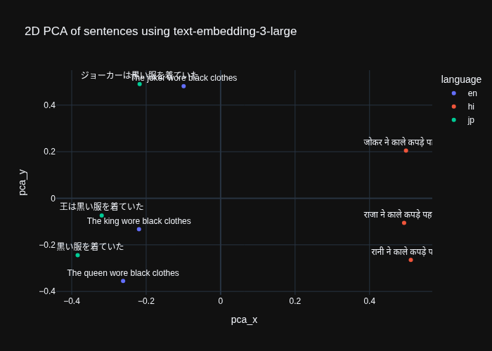

Experimental project to understand and visualize embeddings and various techniques associated with them.

## Why are there ipynb and py files with the same code?
I use Pycharm, which has support for displaying images in a different pane when it finds them in scripts, so converting notebooks to scripts helps with that. If python files and notebooks share the same name, then the python files are most likely Pycharm converted ones and you will get the same code in both files.

